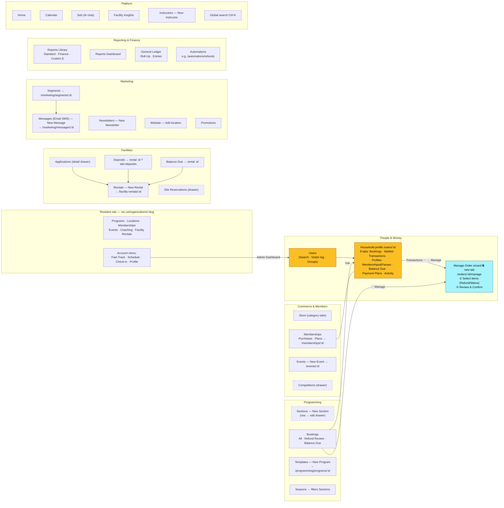

# Rec Product Map v2 — Architecture & Workflows

Breadth-two crawl (7/26–27): all 28 admin destinations **plus one sample record opened in each section** — detail tabs, actions, URL patterns, and drawer-vs-page behavior. Read-only, org-admin test account, Niagara Falls sandbox. No permission walls hit anywhere, so one test account covers full admin video production. Machine-readable version: `product-map.json` in the rec-video-guide plugin (the video skill grounds its recon in it).

## Architecture

**Legend**: gold = the hubs most flows route through · blue = the shared money wizard · dashed = opens a drawer in place instead of navigating (matters for video framing: no page transition to show).

## Workflow reference

Named workflows for video requests — each row is a flow the skill can script from this map. When someone asks for "a video of X", find the row, confirm the entry point, and ask a clarifying question only where the Ambiguity column says so.

| Workflow | Path through the product | Video status / ambiguity to clarify |
|---|---|---|
| Find a user & read their profile | Users → search → household (8 tabs) | 🎞 recorded 7/26, needs narration re-render |
| Refund a transaction | Household → Transactions → ⋯ Manage → wizard ①② | ✅ published 7/27 |
| Refund review queue | Programming → Bookings → *Refund Review* tab | Ask: per-user refund or the org-wide queue? |
| Create a section | Programming → Sections → *New Section* (drawer) | Ask: standalone section or from a Template? |
| Create a program template | Programming → Templates → *New Program* → `/programming/programs/:id` | — |
| Waitlist → roster | Household → Waitlist tab (or section drawer roster) | Ask: from the household side or the section side? |
| Sell a membership to a resident | Purchases tab ⋯ *Purchase Again* · or admin store · Household → Memberships & Passes shows what they hold | Ask: front-desk sale or plan setup? |
| Build/edit a membership plan | Memberships → Plans → *Add Membership* → Select Type (Membership = duration · Pass = N uses) → editor: Basic Info / Coverage & Eligibility (coverage locked after create) / Duration & Pricing (Auto Renew, GL code, special pricing) / Benefits / Forms / Display Settings (admin store · online purchase · desk locations) | 🎞 overview recorded 7/27 |
| Facility rental lifecycle | Facilities → Rentals → *New Rental* → `/facility-rentals/:id`; Applications drawer feeds it; Deposits & Balance Due are tabs/views of the same rental | Ask: which stage (application, booking, deposit, balance)? |
| Create an event | Events → *New Event* → `/events/:id` | — |
| Send a marketing message | Marketing → Segments (build audience) → Messages → *New Message* (Email/SMS) | Ask: one-off message or newsletter? |
| Run a report | Reports → Library (Standard/Finance/Custom) or Dashboard | Ask: which report? |
| GL reconciliation | Accounting → General Ledger → Roll-Up / Entries | — |
| Refund automations | Automations → `/automations/refunds` | New find — worth a short video of its own |
| Add an instructor | Instructors → *New Instructor* | — |
| New-admin orientation / getting started | Public site tabs → login → account menu → Admin Dashboard → sidebar groups → name-click → Settings → Training Center | 🎞 'Welcome to Rec' recorded 7/27 |

## Crawl notes (delta from v1)

- **Detail URL patterns captured** for Bookings (→ household), Templates (`/programming/programs/:id`), Events, Rentals, Messages, Segments, Memberships plans, Applications (drawer with `drawerId=rental-application-details`), Deposits/Balance Due (both resolve to the rental record).
- **Drawer sections** (no navigation on row click): Sections, Competitions, Site Reservations, Applications. Videos of these flows should zoom/caption the drawer, since there's no URL change to anchor on.
- **Seasons** is a filter view over Sections, not its own records.
- **Automations** contains at least a refunds automation — relevant to the refund video series.
- **Memberships deep recon (7/27)**: Purchases tab has KPI cards (Usage/Purchases/Cancellations/Payments, 30-day default range); purchase-row ⋯ = View Last Receipt / Cancel Membership / Purchase Again; plan-row ⋯ = Edit / Unpublish from Internal|Public Store (per-store globes in the table). Plan editor is a full-screen modal; membership type adds Auto Renew (card-only), passes carry punch-style Access Benefits. Household **Memberships & Passes** tab can flash 'No results.' while loading — wait for rows before filming.
- **Account menu & Settings (7/27)**: clicking the user's name (top-left of the sidebar) opens a menu — Settings · Desk location · My notifications · Rec admin · **Training Center** (Rec University link) · Share feedback · Log out. `/settings` is the control room: Organization Details, Desk Locations, Email, SMS, Finance, Forms, Items, Members/Roles & Permissions, Policies, Permits, Scholarships, Integrations, AI Refund Suggestions, Manage locations. Global search (Ctrl-K) returns grouped People/Sections/Transactions/Pages results.
- **No permission walls** anywhere with the org-admin test account. Instructor-portal views remain the only unmapped surface (needs an instructor test login).
